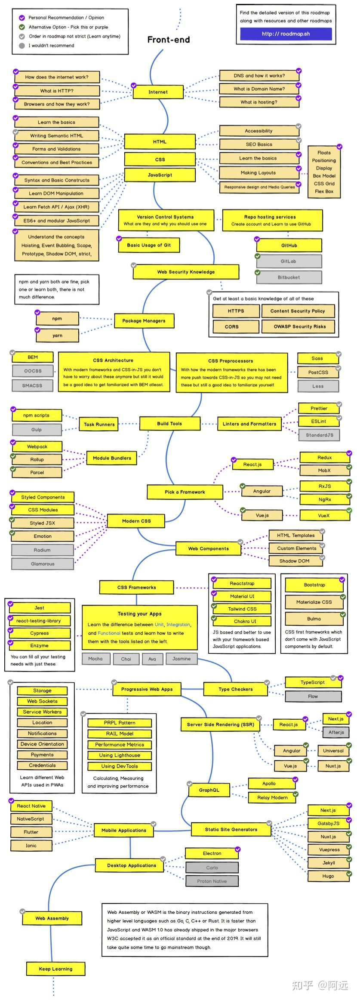

#### 前端学习路径

已学内容

技能
- JavaScript+CSS+HTML 
- Vue
- React

基础
- 网络(HTTP, TCP/IP)
- 数据结构
  - 时间复杂度，空间复杂度
- 操作系统
  - 进程，线程
- 数据库
- 英语

工具
- [github](https://github.com/)
- [Git教程](https://www.liaoxuefeng.com/wiki/896043488029600)
- vscode
- Notepad++
- BeyondCompare
- markdown
- npm
- F12 浏览器网页调试
- 笔记
  - notion
  - 有道云笔记
  - markdown

学习途径
-  [Vue官网](https://cn.vuejs.org/)
-  [Vue Github](https://github.com/vuejs/vue)
- 知乎 https://zhuanlan.zhihu.com/p/339835359
- csdn
- 极客时间 https://time.geekbang.org/dashboard/course
  15178893156
  !qaz2wsx
- https://www.liaoxuefeng.com/
- B站

小目标
- JavaScript+CSS+HTML
- Vue
- 拿得出手的作品

面试
- 面试技巧
- 面试题

长期目标
- 进一线大厂

Roadmap
